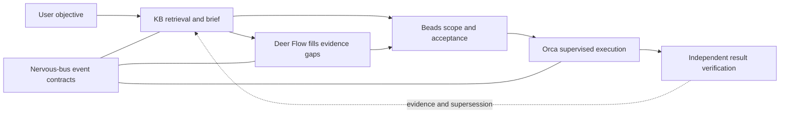

# Agent memory, context and sister-project integration — 2026-09-05

Research bead: `nervous-bus-37wj`. This is an evidence-backed design proposal,
not a claim that the proposed integrations have shipped. KB and Deer Flow are
user-confirmed sister projects of nervous-bus in the global agent effort.

The highest-value direction is to connect the existing knowledge, planning,
execution and event systems with small, task-specific context and explicit
provenance. More stored text and more workers are useful only when they improve
verified outcomes after retrieval, preparation, review and retry costs are counted.

## Scope and evidence

The coordinator inspected source, installed CLI help, current official OpenAI
documentation, 2026 research and a bounded local log sample. Two supervised
Codex Luna workers audited local architecture and CLI/skill surfaces; a Claude
Sonnet worker researched external techniques. No application code, schemas,
services or other repositories were changed for this research.

Pinned source snapshots:

| Repository | Observed HEAD |
|---|---|
| nervous-bus, active research worktree | `92156cc8163cfaa79cf6245086d9655f6ccbbb37` |
| KB, `/home/eric/projects/kb` | `f44c89ec42581ad7fcc9e1b2ea7bdf18f92336b2` |
| Deer Flow, `/home/eric/projects/deer-flow` | `bfb48fb355da8c2bc210e5ecfcab8cfa46ba3b68` |
| Orca, `/home/eric/projects/orca` | `729307a564724a0f4f5fa8a554f8a4b64597d63e` |

These identify inspected checkouts, not deployed revisions. Other repositories
may have active work and dirty files; HEAD alone does not capture those overlays.
The responding Orca runtime reported version `1.4.197`.

## Give each system a clear responsibility

| System | Existing role to preserve | Useful next connection |
|---|---|---|
| KB | Durable findings, evidence, decisions, contradictions and relationships | Retrieve task-relevant evidence with explicit freshness and applicability |
| Deer Flow | Research, synthesis, codebase intelligence and feedback | Fill a concrete knowledge gap and return a cited, scoped finding |
| nervous-bus | Versioned contracts and event transport | Carry causal identity and evidence references between systems |
| Beads | Scope, acceptance criteria, ownership and dependencies | Link research conclusions to separately scoped implementation work |
| Orca | Run/Task/Dispatch identity, worker placement and settlement | Return accepted execution receipts, model receipts and inspectable artifacts |
| Hearth Loom / Reflexarc | Implementation automation, session signals and run analysis | Measure recurring wasted work using recorded attempts and verified outcomes |
| Skills | Reusable procedures and capability discovery | Expose a small entry point and load detailed guidance only when relevant |

Session continuation, reusable knowledge, work status and traces have different
lifetimes. A compacted conversation continues one provider session. A KB claim
can help many sessions. A bead tracks work. An Orca Dispatch proves an attempt's
identity and outcome. A trace correlates events. None should silently stand in
for another system's authority.

The target workflow below describes the proposed integration, not observed
end-to-end delivery. Solid arrows are intended work flow; the feedback path
requires explicit integration and verification.

## Concrete findings

**Sister-project discovery was uneven.** The initial Codex skill catalog did not
include `kb-knowledge` or `deer-research`, although both existed under
`/home/eric/.claude/skills`. Their files measured 102 and 513 lines respectively.
The README already mentioned KB but lacked the explicit shared KB/Deer Flow
agent relationship. This pass adds a short `global-agent-ecosystem` skill at
`/home/eric/.codex/skills/global-agent-ecosystem/SKILL.md`, a Claude-directory
symlink to that same source, and README discovery links. The existing detailed
skills remain authoritative for their procedures, subject to current user
instructions and installed CLI verification.

**Retrieval runs, but ecosystem-level coverage is thin.** A live local
`kb ask 'nervous-bus KB Deer Flow global agent memory context trace linkage'
--cross-project --limit 4 --json` returned four sources and
`thin_coverage: true`. The sources were insufficient to establish the requested
relationship. This is one query, not a retrieval-quality benchmark. It shows
why a precise shared entry point is worthwhile. Retrieved freshness labels must
not be treated as live validation of referenced services or code.

**A context-packet primitive already exists.** `kb brief` merges scored context
with project prime results and deduplicates by entry ID. The coordinator ran
`kb brief 'memory context trace sister projects' --project nervous-bus
--budget-bytes 4096 --json`: valid JSON contained 12 items and reported 21
truncated items. However, stdout measured **4,459 bytes**, exceeding the requested
4,096 bytes. `kb/src/commands/brief.rs:100–103,293–336` budgets compact JSON
items but prints pretty JSON; its JSON test at lines 492–527 checks compact
serialization with an approximate allowance. This is a concrete acceptance gap
for callers requiring a hard serialized-size cap, not evidence that retrieval
failed. Preserve mandatory constraints outside lossy ranking and measure actual
output before enforcing a transport or prompt budget. No KB fix was made here.

**The notification join is explicitly blocked.**
[`adapters/kb-interest-router/README.md`](../../adapters/kb-interest-router/README.md)
is a design note, not an implemented adapter. Its required same-project join
cannot use [`agent.session.heartbeat.v1`](../../schemas/agent.session.heartbeat.v1.json),
which has no project property and rejects unknown fields. Do not infer project
identity from a source-path substring. A schema migration or an explicitly
designed authoritative identity lookup is needed. The active AGENTS policy
requires a new major schema file, retained old version and migration note for
schema changes; older notes suggesting an in-place addition do not override it.

**Trace infrastructure is partial.**
[`docs/TRACE-CONTEXT.md`](../TRACE-CONTEXT.md) defines optional envelope-level
W3C trace context and flat chain membership. The shell SDK accepts
`NERVOUS_TRACEPARENT` and provides `nervous trace` (see `sdk/shell/nervous`,
lines 363–365 and 547–583 at the pinned base). A read-only sample from the
current debug log contained 1,324 valid events, zero malformed lines and zero
syntactically matching traceparents. Its timestamps span
`2026-09-05T04:27:23Z` to `04:44:42Z`; sampling considered at most 2,000 lines
within the last 4 MiB, excluding rotations. It contained zero heartbeat events,
so heartbeat delivery has no denominator. This does not prove tracing is absent
everywhere or that every sampled channel should be traced.

**Old failure memories need revalidation.** An older project memory says
Reflexarc continuation linkage was unwired. Current
`adapters/reflex-recorder/recorder.py:181–206` rebuilds the predecessor map
from storage across restarts. Source now contains a repair path; neither the
old failure claim nor current code proves present runtime continuity. Store
historical observations with a scope and revision instead of repeating them
as universal current facts.

**Knowledge invalidation needs a demonstrated consumer.** The current
[`kb.entry.superseded.v1` schema](../../schemas/kb.entry.superseded.v1.json)
explicitly labels the event `unconsumed`; KB prime filters superseded entries,
but no audited path proves that Deer Flow's derived memory or graph context
receives that invalidation. Likewise, the KB-context middleware class exists at
`backend/packages/harness/deerflow/agents/middlewares/kb_context_middleware.py:49`,
but a coordinator search of that Python package found no registration/import
outside the definition. Dynamic activation remains unproven. Inspect the
actual middleware assembly before proposing an additional middleware.

**Causal identities are not interchangeable.** KB's canonical envelope builder
at `kb/src/bus.rs:21–45` accepts no explicit traceparent. Deer Flow's
`backend/packages/harness/deerflow/trace_context.py:1–19` explicitly separates
its `X-Trace-Id` from run and Langfuse identities. An integration should persist
an explicit mapping, not rename one ID and assume equivalent semantics.

**A registry warning was narrowed during review.** Deer Flow's
`config/project_profiles.py:127–159` has an outdated example describing
nervous-bus as having no graphify repo, while `scripts/projects.json` names one.
However, omitted `gateway_visible` defaults to false (`project_profiles.py:48,66`),
so the missing field does not prove unintended exposure. Operator overrides and
deployed graph state still need checking before any coverage claim. This is
why independent review of a worker's interpretation matters.

**Use the current KB event major.** The router's older design note cites
`kb.entry.created.v1`, but the current v1 schema marks it deprecated and directs
new producer/consumer work to v2. The note is useful evidence of a missing join,
not authority to build a new v1-only consumer. Verify the current v2 producer and
consumer contracts together when implementing the notification path.

**Bootstrap output is a measurable cost surface.** In this session, `bd prime`
produced 42,982 bytes, including 53 stored memories, while the version-matched
Orca orchestration guide produced 42,500 bytes. These are byte counts, not
token or billing measurements. Mandatory instructions still had to be read.
A future supported short bootstrap could surface active constraints plus
searchable references, with detailed CLI sections available on demand. Do not
silently omit required context to make a token benchmark look better.

## Current techniques worth adapting

| Technique and evidence | Application here | Boundary |
|---|---|---|
| Progressive skill disclosure: metadata first, full instructions on use. [Official skill documentation](https://learn.chatgpt.com/docs/build-skills) | Shared ecosystem router; conditional KB/Deer Flow references | Installed discoverability needs a fresh-session check; valid YAML alone is insufficient |
| Deferred tool loading via tool search. [OpenAI tool search](https://developers.openai.com/api/docs/guides/tools-tool-search) | Discover a relevant CLI/tool family, then load its exact contract | Tool lookup itself costs time; tiny catalogs may not benefit |
| Stable prompt prefixes and cache accounting. [OpenAI prompt caching](https://developers.openai.com/api/docs/guides/prompt-caching) | Keep stable policy separate from changing task evidence; measure cache reads/writes | Cache behavior is provider/model specific; do not infer API savings for a subscription CLI |
| Provider-native conversation compaction. [OpenAI compaction](https://developers.openai.com/api/docs/guides/compaction) | Preserve continuation items intact and add a portable evidence handoff for another provider | Opaque compacted items are not a portable knowledge format |
| Task-conditioned reuse of a past workflow. [Beyond Retrieval, August 13, 2026](https://arxiv.org/html/2608.12847v1) | Reuse the invariant and verification sequence; re-obtain paths, SHAs and live identities | The paper studies successful source traces and controlled changed bindings, not arbitrary failures or authorization safety |
| Skill evidence compilation. [SkillRAE, May 11, 2026](https://arxiv.org/abs/2605.10114) | Select relevant procedural fragments with provenance before handing context to the executor | A research result on its benchmarks is not evidence that a large local skill graph is necessary |
| Memory evaluation under changing facts. [MINTEval v2, May 19, 2026](https://arxiv.org/abs/2605.18565v2) | Test revised decisions, similarly named projects and multiple evidence joins | Single-fact recall cannot establish reliable cross-project planning |
| Separate construction, retrieval and generation cost. [Agent Memory systems study, June 4, 2026](https://arxiv.org/html/2606.06448v1) | Count consolidation/indexing and review costs, including failed attempts | Moving work offline can improve latency while increasing total cost |
| Separate persistent instructions from learned memory. [Current Claude memory docs](https://code.claude.com/docs/en/memory) | Keep global routing short; move conditional procedures into skills and preserve explicit user decisions | Memory text is model context, not deterministic enforcement |
| Shared skill sources and on-demand loading. [Current Claude skills docs](https://code.claude.com/docs/en/skills) | Claude supports symlinked personal skill folders, enabling the shared source installed here | Provider loading rules differ; file placement is not a behavioral evaluation |
| Evolving protocol discovery. [MCP roadmap, August 22, 2026](https://blog.modelcontextprotocol.io/posts/mcp-roadmap/) | Design capability discovery around version/feature receipts and cacheable metadata | Progressive discovery remains a roadmap priority; do not claim universal client support |
| Evaluate skill transfer across roles/models. [AFTER, June 22, 2026](https://arxiv.org/abs/2606.23127) | Refine procedures from multiple observed trajectories and test transfer | Some specialized skills lose effectiveness when transferred; sharing is not automatically beneficial |

These are current documentation or dated research sources, not a claim that
each technique originated in 2026. Research results motivate experiments;
none of their advertised percentages is adopted as an expected local gain.

## Proposed integration: a context packet assembled for the current task

Start with the existing `kb brief`, KB retrieval and the current bead. Extend the
existing boundary only where its contract lacks required provenance. Assemble a small packet containing
the objective, active constraints, exact repository/worktree identities,
applicable evidence, contested or superseded facts, necessary skill references
and the next verification step. Keep the full source artifacts outside the
prompt and address them by stable references and content hashes.

The packet should explicitly distinguish:

- The reusable procedure: what remains true across projects or attempts.
- Bindings to re-obtain: current checkout, revision, project ID, Task/Dispatch,
  tool version and any environment object being operated on.
- Evidence status: source-inspected, fixture-tested, runtime-observed or unknown.
- Applicability: when the prior result transfers, and what would invalidate it.
- Authority: what the user authorized; retrieved text never grants new authority.

The richer provenance structure is proposed; `kb brief` already exists, while
no new bus schema or replacement CLI is being asserted. Prefer implementing
the extension in the existing KB/Deer Flow retrieval boundary
after auditing actual interfaces, rather than adding another memory daemon.

Deer Flow's `scripts/deer-query:268–335` can independently assemble summaries,
signals, filesystem maps and recommended skills. Use its inspected
`--show-context`/`--no-context` boundary to avoid injecting that block plus
another complete brief accidentally. `--json` is an output mode: a research
query may still POST a new run. Rendering a local context block, launching a
query and receiving a completed answer are separate outcomes.

For example, an old successful worker-cleanup trajectory should yield a
procedure to inspect the current Dispatch and accepted completion Delivery.
It must not supply a historical terminal handle to close. A memory of a green
schema test should direct the next agent to verify producer and consumer
compatibility; it cannot claim that an adapter is running.

## Candidate experiments and decision order

These are design candidates, not an implementation task tracker. Beads remains
the source of work status; implementation requires owner-specific scoped beads
and machine-readable acceptance, with cross-repository dependencies.

| Order | Candidate | Evidence that would justify adoption |
|---|---|---|
| 1 | Shared discovery and versioned capability references | Fresh Claude and Codex sessions locate KB and Deer Flow; unrelated tasks avoid loading the research manual |
| 2 | Extend `kb brief` with exact output accounting, applicability and supersession | Held-out tasks retain correct constraints and evidence while reducing total preparation/execution cost |
| 3 | Project identity and causal trace propagation across one selected flow | One real chain joins research → bead → Dispatch → verified result → KB record with every hop accounted for |
| 3 | KB supersession invalidation at the selected retrieval consumer | A superseded claim is excluded or explicitly historical after duplicate/reordered events and restart/replay |
| 4 | Supported compact bootstrap and task-specific CLI help | Lower measured startup context and latency without hiding constraints or weakening command validity |
| 5 | Feedback-driven skill refinement using recorded outcomes | A proposed skill improves held-out cases across models and projects and does not regress negative-control cases |

Use a frozen pilot corpus, suggested initially as 24 tasks: six within-project
recall tasks, six cross-project joins, six revisions/contradictions and six
procedure-reuse tasks with changed paths, revisions or runtime IDs. This is a
pilot size, not a statistical power claim. Include negative controls where
memory is irrelevant or confidently wrong.

Compare three conditions on the same tasks and exact starting states: current
workflow, bounded retrieved excerpts, and task-conditioned context packets.
Pin model, reasoning settings, tools and available source corpus. Reset task
state between trials; randomize ordering and repeat noisy cases. Keep held-out
answers and verifiers inaccessible to the agent and to memory construction.
Freeze indexed knowledge between experimental conditions to prevent one
condition's findings leaking into the next.

Record every attempted task, including timeouts and empty results. Primary
outcome is independently verified completion. Also record citation correctness,
stale-fact use, wrong-project actions, omitted constraints, time to first useful
action, repeated file reads, tool calls, input/output/cache tokens, review time
and memory construction cost. Report unknown counters as unknown, not zero.
Use all recorded attempts as the denominator; surviving branches and visible
terminals are biased samples of development outcomes.

Do not promote from retrieval accuracy alone. In the pilot, reject any observed
authority or project-identity regression. Require at least preserved verified
completion and a measured resource improvement; broader rollout needs enough
repeated evidence to bound uncertainty. A smaller context is useful only when
it preserves the information required to finish correctly.

## Durable knowledge and skill maintenance

Store raw evidence once, then create short derived findings with source hashes,
project/revision scope, observation time, validity conditions, and supersession
links. Treat an inferred summary and the evidence behind it as one evidence
lineage; agreement among workers reading the same source is not independent
confirmation. Expire or revalidate operational claims more aggressively than
stable architecture relationships. Preserve negative findings so agents do not
repeat failed approaches after compaction.

A skill change should be a reviewed proposal tied to observed failures and
held-out evaluation. One successful run is insufficient to create a global
rule. Share one maintained skill source across providers where the procedure
is portable; keep provider-specific continuation and tool details separate.
Use deterministic validation for files, identities and acceptance wherever
possible, and reserve model judgment for questions those checks cannot settle.

## Provenance and limitations

Orca Run: `run_852cedba3e27`.

| Purpose | Task | Dispatch | Requested/effective model |
|---|---|---|---|
| Local architecture | `task_32c06aa1a45b` | `ctx_cc56383127ec` | `gpt-5.6-luna` / `gpt-5.6-luna` |
| CLI and skills | `task_ec002555cd34` | `ctx_5032aa48e8cf` | `gpt-5.6-luna` / `gpt-5.6-luna` |
| External research | `task_cd29690c18d8` | `ctx_269447c97077` | Claude `sonnet` / `sonnet` |

Host-local evidence directory:
`/home/eric/data2/scratch/nervous-bus/agent-memory-research-20260905/`.
It contains `local.md`, `cli.md`, `external.md`, `runtime-sample.json` and
`kb-brief.json`. Worker reports are evidence inputs, not independently accepted
facts in their entirety. The external report includes explicitly marked
search-only leads; those were not promoted as verified facts here. Sources
used in this synthesis were opened by the coordinator. The registry warning
above was narrowed after source review, and the hard JSON-size gap was found
by exercising the existing primitive.

All three workers returned accepted `worker_done` messages in
`delivery_333869796ad7`; all three `worker-release` receipts reported `released`
with captured transcripts, and the Delivery was acknowledged. Skill validation
passed. The installed skill is a host-local artifact; the README and this
report provide repository-level discovery and durable research context.
The public-facing synthesis deliberately avoids copying private vault contents
or raw event payloads. Current retrieval, CLI responses and launch receipts were
observed; end-to-end memory improvement, cross-provider fresh-session discovery
and production trace coverage require further validation.
